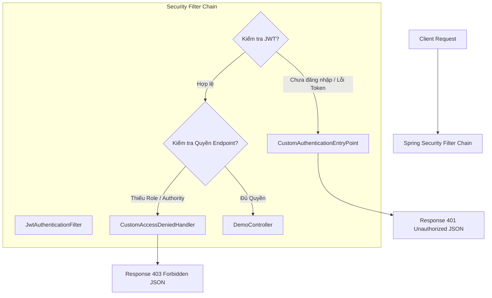
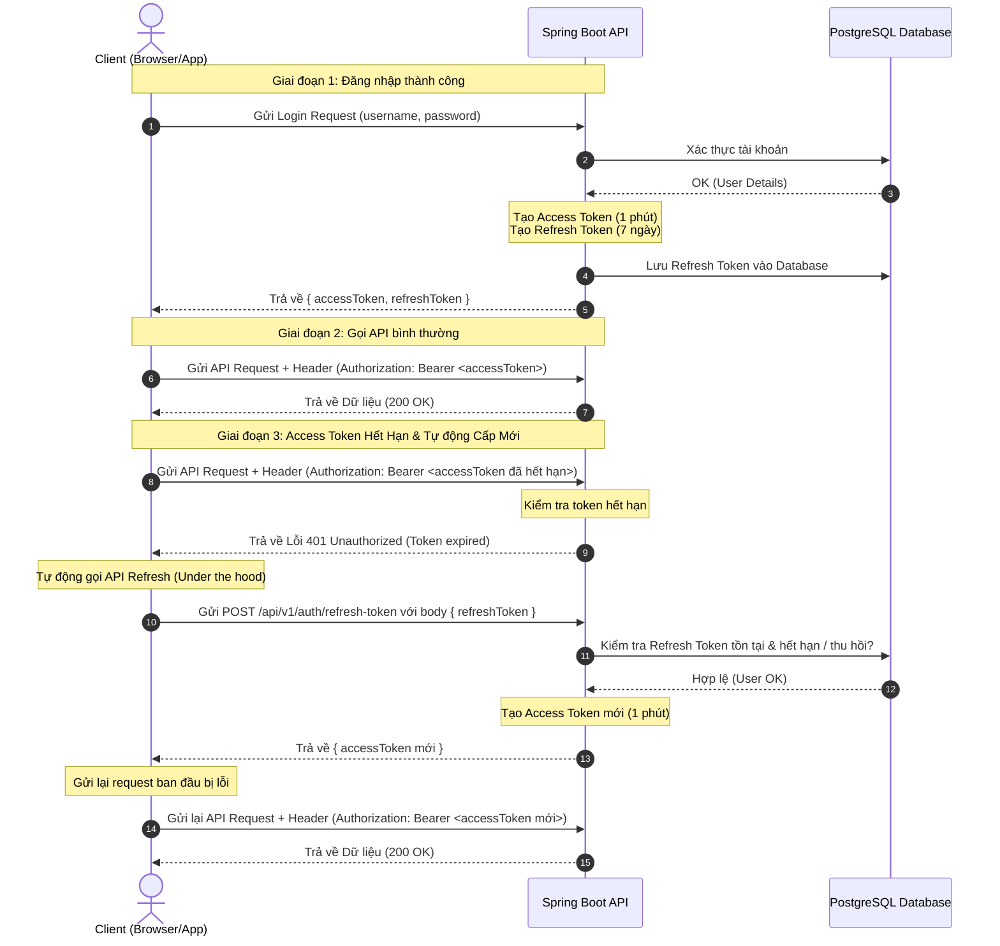

# 🍃 Spring Boot 4.x Masterclass (2026 Edition)

Chào mừng bạn đến với khóa học **Spring Boot 4.x Masterclass** trên YouTube! Đây là nơi lưu trữ toàn bộ mã nguồn, tài liệu và lộ trình từ cơ bản đến chuyên gia (Enterprise Level).

[](YOUR_YOUTUBE_LINK)
[](https://openjdk.org/)
[](https://spring.io/projects/spring-boot)

---

## 🗺️ Lộ trình khóa học (Curriculum)

| Bài    | Nội dung bài giảng                                              | Trạng thái |     Mã nguồn     |
|:-------|:----------------------------------------------------------------|:----------:|:----------------:|
| 01     | Khởi động & Tư duy Backend 2026                                 |   ✅ Done   |  [View Code](#)  |
| 02     | IoC, DI - Nội công tâm pháp                                     |   ✅ Done   |  [View Code](#)  |
| 03     | Spring Container vs Bean                                        |   ✅ Done   |  [View Code](#)  |
| 04     | Pháp thuật Auto-Configuration                                   |   ✅ Done   |  [View Code](#)  |
| 05     | Cấu trúc thư mục Chuẩn Doanh Nghiệp (3-Tier)                    |   ✅ Done   |  [View Code](#)  |
| 06     | Kết nối PostgreSQL vs MySQL & Spring Data JPA                   |   ✅ Done   |  [View Code](#)  |
| 07     | Tạo REST API đầu tiên với @RestController                       |   ✅ Done   |  [View Code](#)  |
| 08     | Ma thuật MapStruct, record, ModderMapper vs ObjectMapper        |   ✅ Done   |  [View Code](#)  |
| 10     | Validation dữ liệu đầu vào & Bắt lỗi toàn cục                   |   ✅ Done   |  [View Code](#)  |
| 11     | Làm chủ Pagination & Sorting trong Spring Boot                  |   ✅ Done   |  [View Code](#)  |
| 12     | Giải ngố về Hibernate vs JPA                                    |   ✅ Done   |  [View Code](#)  |
| 13.A   | TOÀN TẬP QUAN HỆ 1-N & TRUY QUÉT N+1 QUERY                      |   ✅ Done   |  [View Code](#)  |
| 13.B   | Hiểu PERSIST, MERGE, REMOVE, ALL, orphanRemoval – Khi nào dùng? |   ✅ Done   |  [View Code](#)  |
| 14     | Quản lý Database Migration với Flyway trong Spring Boot         |   ✅ Done   |  [View Code](#)  |
| 15     | Phân biệt file YAML vs Properties và cấu hình đa môi trường     |   ✅ Done   |  [View Code](#)  |
| 16     | "NGƯỜI GÁC CỔNG" Spring Security - KIẾN TRÚC LÕI                |   ✅ Done   |  [View Code](#)  |
| 17     | Vũ khí JWT & Xây dựng Custom Filter                             |   ✅ Done   |  [View Code](#)  |
| 18     | Bộ 3 Quyền Lực: Móc nối Database vào luồng Xác thực             |   ✅ Done   |  [View Code](#)  |
| 19     | Phân quyền RBAC & Xử lý Exception "Chuẩn Doanh Nghiệp"          |   ✅ Done   | [View Code](#explore-lesson-19) |
| **20** | **Kỹ thuật Refresh Token – Giữ phiên đăng nhập "Bất tử"**      | 🚀 Current | [**Explore**](#explore-lesson-20) |


---

## 🏗️ Kiến trúc dự án (Architecture)

Trong series này, chúng ta tuân thủ nghiêm ngặt mô hình **3-Tier Architecture** kết hợp với **DTO Pattern** để đảm bảo tính bảo mật và hiệu năng.

### Sơ đồ luồng dữ liệu (Data Flow)
`Client` ↔️ `Controller` ↔️ `Service` ↔️ `Repository` ↔️ `Database (PostgreSQL)`

### Quy tắc đặt tên (Naming Convention)
* **Controller**: `UserController.java` (Endpoints & Validation)
* **Service**: `UserService.java` (Interface) & `UserServiceImpl.java` (Logic)
* **Repository**: `UserRepository.java` (JPA Interface)
* **DTO**: `UserRequest.java`, `UserResponse.java`

---

## 📂 Chi tiết cấu trúc thư mục

```text
src/main/java/com/springmasterclass/study
├── 📁 anotation        # Custom Annotation & Validators (CCCD, v.v.)
├── 📁 config           # Cấu hình Bean (ModelMapper, DatabaseConfigs)
├── 📁 controller       # Tiếp nhận Request (RestControllers, DemoController)
├── 📁 service          # Xử lý nghiệp vụ (Business Logic)
├── 📁 repository       # Truy vấn dữ liệu (Spring Data JPA, Specifications)
├── 📁 entity           # Map trực tiếp với Database Table (Product, User, Patient)
├── 📁 dto              # Data Transfer Objects (Request/Response Records)
├── 📁 mapper           # Chuyển đổi Entity <-> DTO (MapStruct)
├── 📁 security         # Bảo mật hệ thống (SecurityConfig, CustomDetailsService, JWT Filter)
└── 📁 exception        # Xử lý lỗi toàn cục (GlobalExceptionHandler, Custom Authentication Handlers)
```

---

<div id="explore-lesson-19"></div>

# 🚀 Bài 19: Phân quyền RBAC & Xử lý Exception "Chuẩn Doanh Nghiệp"

Trong bài học này, chúng ta sẽ nâng cấp hệ thống Spring Security lên cấp độ doanh nghiệp bằng cách giải quyết 2 bài toán cực kỳ quan trọng:
1. **Phân quyền dựa trên vai trò (Role-Based Access Control - RBAC)** & **Quyền hạn chi tiết (Authority/Permission)** sử dụng `@PreAuthorize` và cấu hình Method Security.
2. **Xử lý ngoại lệ bảo mật tập trung (Custom Security Exceptions)** để chuyển đổi các lỗi thô mặc định của Tomcat/Spring Security (như trang HTML Whitelabel trống, hay HTTP Status 403 trơn) thành cấu trúc JSON API sạch đẹp, đồng bộ với hệ thống.

---

## 💡 Lý thuyết cốt lõi (Core Concepts)

### 1. Phân biệt Roles vs Authorities trong Spring Security
* **Roles (Vai trò)**: Đại diện cho một nhóm người dùng (ví dụ: `ADMIN`, `USER`, `DOCTOR`). Trong Spring Security, Role bắt buộc phải bắt đầu bằng tiền tố `ROLE_`. Khi kiểm tra quyền bằng `hasRole('ADMIN')`, thực chất Spring đang kiểm tra authority tên là `ROLE_ADMIN`.
* **Authorities/Permissions (Quyền hạn)**: Đại diện cho một hành động cụ thể trên một tài nguyên (ví dụ: `patient:read`, `patient:write`). Các quyền hạn này không cần tiền tố và kiểm tra thông qua `hasAuthority('patient:read')`.
* **Cơ chế lưu trữ động**: Trong cơ sở dữ liệu (Database), ta có thể lưu trữ danh sách các vai trò và quyền hạn của User dưới dạng một chuỗi phân tách bằng dấu phẩy (comma-separated string), ví dụ: `ROLE_DOCTOR,patient:read`. Khi `loadUserByUsername`, ta phân tách chuỗi này thành danh sách các `SimpleGrantedAuthority`.

### 2. Sơ đồ xử lý Exception trong Spring Security
Mặc định, các ngoại lệ phát sinh bên trong **Filter Chain** (như JWT không hợp lệ, hoặc không đủ quyền truy cập) sẽ **không** đi qua `@RestControllerAdvice` thông thường vì nó nằm ngoài phạm vi xử lý của DispatcherServlet. Để xử lý "Chuẩn Doanh Nghiệp", chúng ta cần bắt kịp các lỗi này ở tầng Filter bằng cách cung cấp các Bean chuyên biệt:



---

## 🛠️ Chi tiết triển khai mã nguồn (Implementation Details)

### 1. Cấu hình Method Security & Đăng ký Custom Handlers
Để sử dụng các annotation phân quyền như `@PreAuthorize` trên từng Endpoint, chúng ta bật tính năng này bằng cách thêm `@EnableMethodSecurity` vào cấu hình Security.

Trong file [SecurityConfig.java](file:///d:/study_with_2026/study/src/main/java/com/springmasterclass/study/security/SecurityConfig.java):
```java
@Configuration
@EnableWebSecurity
@EnableMethodSecurity // Bật phân quyền mức Method (hỗ trợ @PreAuthorize, @PostAuthorize)
public class SecurityConfig {

    @Autowired
    private CustomAuthenticationEntryPoint authenticationEntryPoint;

    @Autowired
    private CustomAccessDeniedHandler accessDeniedHandler;

    @Bean
    public SecurityFilterChain securityFilterChain(HttpSecurity http) throws Exception {
        http
            .csrf(AbstractHttpConfigurer::disable)
            .cors(Customizer.withDefaults())
            .authorizeHttpRequests(auth -> auth
                .requestMatchers("/api/v1/categories/**").permitAll()
                .requestMatchers("/api/v1/auth/**").permitAll()
                .requestMatchers("/error").permitAll()
                .anyRequest().authenticated()
            )
            .sessionManagement(session -> session
                .sessionCreationPolicy(SessionCreationPolicy.STATELESS)
            )
            // Đăng ký các Custom Handler xử lý Exception Security
            .exceptionHandling(ex -> ex
                .authenticationEntryPoint(authenticationEntryPoint) // Xử lý lỗi 401
                .accessDeniedHandler(accessDeniedHandler)           // Xử lý lỗi 403
            )
            .addFilterBefore(jwtAuthenticationFilter, UsernamePasswordAuthenticationFilter.class);

        return http.build();
    }
}
```

### 2. Tách và Nạp Quyền Hạn Động từ Database
Trong thực tế doanh nghiệp, một User có thể có nhiều vai trò và quyền hạn được lưu chung trong một cột ở Database. Spring Security cho phép chuyển đổi chuỗi này thành danh sách `GrantedAuthority`.

Trong file [User.java](file:///d:/study_with_2026/study/src/main/java/com/springmasterclass/study/entity/auth/User.java):
```java
@Entity(name = "AuthUser")
@Table(name = "users")
@Data
@NoArgsConstructor
public class User implements UserDetails {
    // ... các trường khác
    private String role;   // Lưu trữ chuỗi dạng: "ROLE_ADMIN" hoặc "patient:read,ROLE_DOCTOR"

    @Override
    public Collection<? extends GrantedAuthority> getAuthorities() {
        // Tách chuỗi role theo dấu phẩy, trim khoảng trắng và map sang SimpleGrantedAuthority
        return Arrays.stream(role.split(","))
                .map(String::trim)
                .map(SimpleGrantedAuthority::new)
                .collect(Collectors.toList());
    }
    // ...
}
```

### 3. Xử lý Lỗi Chưa Xác Thực (401 Unauthorized)
Khi một request không gửi kèm token hợp lệ hoặc token đã hết hạn truy cập vào API được bảo vệ, `AuthenticationEntryPoint` sẽ được kích hoạt để trả về cấu trúc lỗi chuẩn JSON.

Trong file [CustomAuthenticationEntryPoint.java](file:///d:/study_with_2026/study/src/main/java/com/springmasterclass/study/exception/CustomAuthenticationEntryPoint.java):
```java
@Component
public class CustomAuthenticationEntryPoint implements AuthenticationEntryPoint {

    @Override
    public void commence(HttpServletRequest request, HttpServletResponse response, 
                         AuthenticationException authException) throws IOException, ServletException {
        response.setStatus(HttpServletResponse.SC_UNAUTHORIZED);
        response.setContentType("application/json;charset=UTF-8");
        
        response.getWriter().write(
                Map.of(
                        "code", 401,
                        "message", "Bạn chưa đăng nhập hoặc token không hợp lệ!"
                ).toString()
        );
    }
}
```

### 4. Xử lý Lỗi Thiếu Quyền Truy Cập (403 Forbidden)
Khi người dùng đã đăng nhập thành công (JWT hợp lệ) nhưng cố tình truy cập vào các API yêu cầu các vai trò cao hơn (như ADMIN) hoặc các quyền hạn chuyên biệt mà tài khoản của họ không sở hữu, `AccessDeniedHandler` sẽ chặn lại và trả về lỗi 403 tùy biến dạng JSON.

Trong file [CustomAccessDeniedHandler.java](file:///d:/study_with_2026/study/src/main/java/com/springmasterclass/study/exception/CustomAccessDeniedHandler.java):
```java
@Component
public class CustomAccessDeniedHandler implements AccessDeniedHandler {

    @Override
    public void handle(HttpServletRequest request, HttpServletResponse response, 
                       AccessDeniedException accessDeniedException) throws IOException, ServletException {
        response.setStatus(HttpServletResponse.SC_FORBIDDEN);
        response.setContentType("application/json;charset=UTF-8");
        
        response.getWriter().write(
                Map.of(
                        "code", 403,
                        "message", "Bạn không có quyền truy cập!"
                ).toString()
        );
    }
}
```

### 5. Áp dụng Phân Quyền ở tầng Controller
Chúng ta có thể áp dụng linh hoạt việc kiểm tra Role (`hasRole`), nhóm Role (`hasAnyRole`), hoặc Quyền hạn cụ thể (`hasAuthority`) ngay tại các hàm tiếp nhận Request.

Trong file [DemoController.java](file:///d:/study_with_2026/study/src/main/java/com/springmasterclass/study/controller/DemoController.java):
```java
@RestController
@RequestMapping("/api/v1/demo")
public class DemoController {

    // Chỉ có người dùng sở hữu vai trò ROLE_ADMIN mới vào được
    @GetMapping("/admin")
    @PreAuthorize("hasRole('ADMIN')")
    public String adminOnly() {
        return "Chỉ admin mới thấy được nội dung này!";
    }

    // Cả vai trò ROLE_USER và ROLE_ADMIN đều được cấp quyền vào
    @GetMapping("/user")
    @PreAuthorize("hasAnyRole('USER', 'ADMIN')")
    public String userOrAdmin() {
        return "Cả user và admin đều vào được.";
    }

    // Yêu cầu quyền hạn chi tiết 'patient:read' (bất kể họ mang vai trò gì)
    @GetMapping("/patient/read")
    @PreAuthorize("hasAuthority('patient:read')")
    public String readPatient() {
        return "Đọc hồ sơ bệnh nhân";
    }

    // Yêu cầu quyền hạn chi tiết 'patient:write'
    @PostMapping("/patient/write")
    @PreAuthorize("hasAuthority('patient:write')")
    public String writePatient() {
        return "Ghi hồ sơ bệnh nhân";
    }

    // Yêu cầu người dùng chỉ cần được xác thực (đăng nhập thành công)
    @GetMapping("/me")
    @PreAuthorize("isAuthenticated()")
    public Authentication getCurrentUser() {
        return SecurityContextHolder.getContext().getAuthentication();
    }
}
```

---

## 🚦 Hướng dẫn Kiểm thử & Xác minh (Verification Guide)

Dữ liệu kiểm thử đã được nạp sẵn qua cấu hình Migration [V6__insert_more_users.sql](file:///d:/study_with_2026/study/src/main/resources/db/migration/user/V6__insert_more_users.sql) với các thông tin tài khoản:
1. **User `admin`**: Có vai trò `ROLE_ADMIN`.
2. **User `doctor`**: Có vai trò `ROLE_DOCTOR` và quyền hạn cụ thể `patient:read`.

### Bước 1: Lấy mã JWT Token (Đăng nhập)
Sử dụng cURL hoặc Postman để gọi Endpoint đăng nhập:
```bash
curl -X POST http://localhost:8080/api/v1/auth/login \
     -H "Content-Type: application/json" \
     -d '{"username": "admin", "password": "your_password"}'
```
> **Lưu ý**: Hãy đảm bảo bạn sử dụng mật khẩu chính xác đã được mã hóa BCrypt tương ứng với tài khoản nạp từ cơ sở dữ liệu.

### Bước 2: Kiểm thử kịch bản Lỗi 401 Unauthorized (Chưa đăng nhập)
Gửi yêu cầu trực tiếp vào API được bảo vệ mà không đính kèm Header Authorization:
```bash
curl -X GET http://localhost:8080/api/v1/demo/admin
```
**Phản hồi mong đợi (HTTP Status 401):**
```json
{
  "code": 401,
  "message": "Bạn chưa đăng nhập hoặc token không hợp lệ!"
}
```

### Bước 3: Kiểm thử kịch bản Lỗi 403 Forbidden (Thiếu quyền)
Sử dụng JWT Token của tài khoản **`doctor`** (chỉ có quyền `patient:read`, không có quyền Admin) để truy cập API `/api/v1/demo/admin`:
```bash
curl -X GET http://localhost:8080/api/v1/demo/admin \
     -H "Authorization: Bearer <JWT_CỦA_DOCTOR>"
```
**Phản hồi mong đợi (HTTP Status 403):**
```json
{
  "code": 403,
  "message": "Bạn không có quyền truy cập!"
}
```

### Bước 4: Kiểm thử kịch bản Thành công (Đúng vai trò/quyền)
Sử dụng JWT Token của tài khoản **`doctor`** để truy cập API yêu cầu quyền hạn `patient:read`:
```bash
curl -X GET http://localhost:8080/api/v1/demo/patient/read \
     -H "Authorization: Bearer <JWT_CỦA_DOCTOR>"
```
**Phản hồi mong đợi (HTTP Status 200):**
```text
Đọc hồ sơ bệnh nhân
```

Sử dụng JWT Token của tài khoản **`admin`** để truy cập API yêu cầu vai trò `ROLE_ADMIN`:
```bash
curl -X GET http://localhost:8080/api/v1/demo/admin \
     -H "Authorization: Bearer <JWT_CỦA_ADMIN>"
```
**Phản hồi mong đợi (HTTP Status 200):**
```text
Chỉ admin mới thấy được nội dung này!
```

---

## 🎯 Tổng kết giá trị "Chuẩn Doanh Nghiệp"
* **Bảo mật tối đa**: Ngăn chặn rò rỉ cấu trúc ứng dụng và các thông tin nhạy cảm của Tomcat server.
* **Đồng nhất dữ liệu API**: Toàn bộ lỗi được định dạng dạng cấu trúc JSON duy nhất (`code` và `message`), giúp lập trình viên Frontend hoặc Mobile dễ dàng xử lý ngoại lệ đồng bộ trên giao diện.
* **Mở rộng dễ dàng**: Phân quyền chi tiết (Authority-based) giúp hệ thống sẵn sàng nâng cấp lên luồng phân quyền động, quản lý động qua database mà không cần sửa đổi cấu trúc code.

---

<div id="explore-lesson-20"></div>

# 🚀 Bài 20: Kỹ thuật Refresh Token – Giữ phiên đăng nhập "Bất tử"

Trong các hệ thống thực tế (Enterprise Application), việc chỉ sử dụng Access Token (JWT) có thời hạn ngắn (ví dụ: 1 phút đến 15 phút) giúp hạn chế tối đa rủi ro khi token bị lộ. Tuy nhiên, nếu bắt người dùng phải đăng nhập lại liên tục mỗi khi token hết hạn thì trải nghiệm khách hàng sẽ cực kỳ tệ.

Để giải quyết vấn đề này, kỹ thuật **Refresh Token** ra đời. Bài viết này sẽ hướng dẫn cách xây dựng cơ chế cấp mới Access Token tự động thông qua Refresh Token được lưu trữ bảo mật dưới Database, giúp phiên làm việc của người dùng diễn ra liên tục, mượt mà mà vẫn đảm bảo tính an toàn cao nhất.

---

## 💡 Lý thuyết cốt lõi (Core Concepts)

### 1. Tại sao cần Refresh Token?
* **Access Token (JWT)**: Thường có vòng đời ngắn (Short-lived), chứa thông tin quyền hạn và được gửi kèm theo mọi request API. Vì thường xuyên truyền đi trên môi trường internet, rủi ro bị đánh cắp là rất lớn. Do đó, thời gian hết hạn của Access Token cần đặt ở mức cực kỳ ngắn.
* **Refresh Token**: Thường có vòng đời dài (Long-lived - ví dụ: 7 ngày, 30 ngày), chỉ dùng một mục đích duy nhất là gửi lên server để yêu cầu cấp lại Access Token mới khi Access Token cũ hết hạn. Refresh Token chỉ truyền qua mạng khi thực hiện làm mới (refresh) token, giảm thiểu đáng kể tần suất hiển thị trên đường truyền.
* **Cơ chế hoạt động**: Khi Access Token hết hạn (Server trả về `401 Unauthorized`), client (Frontend/App) sẽ tự động gửi Refresh Token ẩn dưới nền để lấy Access Token mới, sau đó thử lại request cũ. Người dùng không hề nhận ra sự gián đoạn này.

### 2. Sơ đồ luồng hoạt động (Token Refresh Lifecycle)



### 3. Kỹ thuật Bảo mật & Quản lý Trạng thái Refresh Token
* **Revocation (Thu hồi)**: Khi người dùng nhấn nút Logout hoặc khi hệ thống phát hiện hành vi đáng ngờ, toàn bộ Refresh Token của User đó sẽ bị xóa/vô hiệu hóa trong database (`revoked = true`).
* **Database Storage**: Khác với Access Token (Stateless), Refresh Token cần được lưu trữ ở Database (Stateful) để Server kiểm soát được trạng thái và có thể chủ động hủy phiên đăng nhập từ xa.

---

## 🛠️ Chi tiết triển khai mã nguồn (Implementation Details)

### 1. Database Schema
Bảng `refresh_tokens` liên kết với bảng `users` qua khóa ngoại `user_id`. Tệp migration [V7__create_refresh_tokens_table.sql](file:///d:/study_with_2026/study/src/main/resources/db/migration/user/V7__create_refresh_tokens_table.sql):
```sql
CREATE TABLE IF NOT EXISTS refresh_tokens (
    id BIGSERIAL PRIMARY KEY,
    token VARCHAR(255) NOT NULL UNIQUE,
    user_id VARCHAR(36) NOT NULL,
    expiry_date TIMESTAMP NOT NULL,
    revoked BOOLEAN DEFAULT FALSE,
    CONSTRAINT fk_refresh_token_user FOREIGN KEY (user_id) REFERENCES users(id)
);
```

### 2. Thực thể RefreshToken (Entity)
Trong file [RefreshToken.java](file:///d:/study_with_2026/study/src/main/java/com/springmasterclass/study/entity/auth/RefreshToken.java):
```java
@Entity
@Table(name = "refresh_tokens")
@Data
@NoArgsConstructor
@AllArgsConstructor
@Builder
public class RefreshToken {
    @Id
    @GeneratedValue(strategy = GenerationType.IDENTITY)
    private Long id;

    @Column(nullable = false, unique = true)
    private String token;

    @ManyToOne
    @JoinColumn(name = "user_id", nullable = false)
    private User user;

    @Column(nullable = false)
    private Instant expiryDate;

    private boolean revoked;
}
```

### 3. Repository
Trong file [RefreshTokenRepository.java](file:///d:/study_with_2026/study/src/main/java/com/springmasterclass/study/repository/auth/RefreshTokenRepository.java):
```java
public interface RefreshTokenRepository extends JpaRepository<RefreshToken, Long> {
    Optional<RefreshToken> findByToken(String token);
    void deleteAllByUserId(String userId);
}
```

### 4. Cấu hình thời gian sống của Token
Trong file cấu hình [application-dev.yml](file:///d:/study_with_2026/study/src/main/resources/application-dev.yml):
```yaml
jwt:
  secret: "c2lsdmVyc3ByaW5nYm9vdG5vcm1hbHNlY3VyZWtleW11c3RiZWxvbmc0NTY3ODkwMTIzNDU2Nzg5MDEy"
  expiration: 60000             # Access Token: 1 phút (60,000 ms)
  refresh-expiration: 604800000 # Refresh Token: 7 ngày (604,800,000 ms)
```

### 5. Nghiệp vụ Quản lý Refresh Token (Service)
Trong file [RefreshTokenService.java](file:///d:/study_with_2026/study/src/main/java/com/springmasterclass/study/security/service/RefreshTokenService.java):
```java
@Service
@RequiredArgsConstructor
public class RefreshTokenService {

    @Value("${jwt.refresh-expiration}")
    private Long refreshTokenExpirationMs;

    private final RefreshTokenRepository refreshTokenRepository;
    private final AuthUserRepository authUserRepository;

    @Transactional
    public RefreshToken createRefreshToken(String userId) {
        User user = authUserRepository.findById(userId)
                .orElseThrow(() -> new IllegalArgumentException("User not exist!"));

        // Xóa tất cả token cũ của user để đảm bảo tại một thời điểm chỉ có 1 token hoạt động (hoặc giới hạn phiên)
        refreshTokenRepository.deleteAllByUserId(userId);

        RefreshToken refreshToken = RefreshToken.builder()
                .user(user)
                .token(UUID.randomUUID().toString())
                .expiryDate(Instant.now().plusMillis(refreshTokenExpirationMs))
                .revoked(false)
                .build();
        return refreshTokenRepository.save(refreshToken);
    }

    public Optional<RefreshToken> findByToken(String token) {
        return refreshTokenRepository.findByToken(token);
    }

    public RefreshToken verifyExpiration(RefreshToken refreshToken) {
        if (refreshToken.getExpiryDate().compareTo(Instant.now()) < 0) {
            refreshToken.setRevoked(true);
            refreshTokenRepository.save(refreshToken);
            throw new RuntimeException("Refresh token expiry!");
        }
        return refreshToken;
    }

    @Transactional
    public void revokeAllUserToken(String userId) {
        refreshTokenRepository.deleteAllByUserId(userId);
    }
}
```

### 6. Controller xử lý luồng Authentication & Refresh
Trong file [AuthController.java](file:///d:/study_with_2026/study/src/main/java/com/springmasterclass/study/controller/AuthController.java):
* **Đăng nhập (`/login`)**: Sinh cả Access Token (ngắn hạn) và Refresh Token (dài hạn), trả về cho client.
* **Làm mới Token (`/refresh-token`)**: Nhận `refreshToken`, kiểm tra tính hợp lệ và thời hạn, sau đó sinh mới Access Token.
* **Đăng xuất (`/logout`)**: Vô hiệu hóa/xóa bỏ toàn bộ Refresh Token của user trong database.

```java
@RestController
@RequiredArgsConstructor
@RequestMapping("/api/v1/auth")
public class AuthController extends BaseController {

    private final AuthenticationManager authenticationManager;
    private final JwtService jwtService;
    private final RefreshTokenService refreshTokenService;
    private final AuthUserRepository userRepository;

    @PostMapping("/login")
    public ApiResponse<ResponseEntity<?>> login(@RequestBody LoginRequest loginRequest) {
        Authentication authentication = authenticationManager.authenticate(
                new UsernamePasswordAuthenticationToken(
                        loginRequest.getUsername(),
                        loginRequest.getPassword()
                )
        );

        User user = (User) authentication.getPrincipal();
        String accessToken = jwtService.generateToken(user);
        RefreshToken refreshToken = refreshTokenService.createRefreshToken(user.getId());
        
        return ApiResponse.success(new ResponseEntity<>(Map.of(
                "accessToken", accessToken,
                "refreshToken", refreshToken.getToken()
        ), HttpStatus.OK));
    }

    @PostMapping("/refresh-token")
    public ApiResponse<ResponseEntity<?>> refreshToken(@RequestBody Map<String, String> request) {
        String refreshTokenStr = request.get("refreshToken");
        if (refreshTokenStr == null) {
            throw new RuntimeException("Refresh token not null");
        }

        RefreshToken refreshToken = refreshTokenService.findByToken(refreshTokenStr)
                .orElseThrow(() -> new RuntimeException("Refresh don't exist"));

        if (refreshToken.isRevoked()) {
            throw new RuntimeException("Refresh token revoked");
        }

        RefreshToken verifiedToken = refreshTokenService.verifyExpiration(refreshToken);
        User user = verifiedToken.getUser();
        String newAccessToken = jwtService.generateToken(user);

        return ApiResponse.success(new ResponseEntity<>(Map.of(
                "accessToken", newAccessToken
        ), HttpStatus.OK));
    }

    @PostMapping("/logout")
    public ApiResponse<ResponseEntity<?>> logout(@RequestHeader("Authorization") String authorization) {
        String token = authorization.substring(7);
        String username = jwtService.extractUsername(token);
        User user = userRepository.findByUsername(username)
                .orElseThrow(() -> new RuntimeException("User not found"));
                
        // Thu hồi toàn bộ Refresh Token khi đăng xuất
        refreshTokenService.revokeAllUserToken(user.getId());
        
        return ApiResponse.success(new ResponseEntity<>(Map.of(
                "message", "Logout Successfully"
        ), HttpStatus.OK));
    }
}
```

---

## 🚦 Hướng dẫn Kiểm thử & Xác minh (Verification Guide)

### Bước 1: Đăng nhập lấy cặp Token
Gửi request đăng nhập bằng tài khoản hợp lệ:
```bash
curl -X POST http://localhost:9090/api/v1/auth/login \
     -H "Content-Type: application/json" \
     -d '{"username": "admin", "password": "your_password"}'
```
**Phản hồi mong đợi:**
```json
{
  "status": "success",
  "data": {
    "accessToken": "eyJhbGciOiJIUzI1NiJ9.eyJzdWIiOiJhZG1pbiIs...",
    "refreshToken": "48b61c92-d66a-493e-868d-8a1a4574ad82"
  }
}
```

### Bước 2: Sử dụng Access Token truy cập tài nguyên bảo mật
```bash
curl -X GET http://localhost:9090/api/v1/demo/admin \
     -H "Authorization: Bearer <accessToken>"
```
* Sau khi hết 1 phút (Access Token hết hạn), request tiếp theo sẽ trả về lỗi **401 Unauthorized**.

### Bước 3: Cấp mới Access Token bằng Refresh Token
Khi Access Token hết hạn, gửi Refresh Token lên endpoint `/refresh-token`:
```bash
curl -X POST http://localhost:9090/api/v1/auth/refresh-token \
     -H "Content-Type: application/json" \
     -d '{"refreshToken": "48b61c92-d66a-493e-868d-8a1a4574ad82"}'
```
**Phản hồi mong đợi:**
```json
{
  "status": "success",
  "data": {
    "accessToken": "eyJhbGciOiJIUzI1NiJ9.eyJzdWIiOiJhZG1pbiIs..._NEW_TOKEN"
  }
}
```
* Sử dụng `accessToken` mới này để tiếp tục truy cập các API bình thường.

### Bước 4: Đăng xuất và Thu hồi Token
Thực hiện đăng xuất để xóa Refresh Token trong cơ sở dữ liệu:
```bash
curl -X POST http://localhost:9090/api/v1/auth/logout \
     -H "Authorization: Bearer <accessToken>"
```
**Thử refresh lại sau khi đã logout:**
Gửi lại Refresh Token cũ lên API làm mới:
```bash
curl -X POST http://localhost:9090/api/v1/auth/refresh-token \
     -H "Content-Type: application/json" \
     -d '{"refreshToken": "48b61c92-d66a-493e-868d-8a1a4574ad82"}'
```
**Phản hồi mong đợi:**
* Server ném ra biệt lệ (Exception) do Refresh Token đã bị xóa khỏi Database khi thực hiện Logout.

---

## 🎯 Tổng kết giá trị của Kỹ thuật Refresh Token
* **Cân bằng giữa Bảo mật & UX**: Giúp ứng dụng duy trì bảo mật cao với Access Token vòng đời siêu ngắn, nhưng vẫn mang lại trải nghiệm liền mạch cho người dùng cuối.
* **Kiểm soát phiên đăng nhập**: Việc lưu trữ Refresh Token trên Database cho phép quản trị viên có thể "hủy quyền" đăng nhập bất cứ khi nào bằng cách xóa token khỏi bảng `refresh_tokens`.
* **Sẵn sàng cho các tính năng nâng cao**: Dễ dàng nâng cấp thêm các tính năng như: "Đăng xuất khỏi tất cả các thiết bị", "Quản lý thiết bị đang hoạt động (Active Sessions)", hoặc kỹ thuật **Refresh Token Rotation** (tự động cấp mới cả Refresh Token sau mỗi lần gọi refresh).
